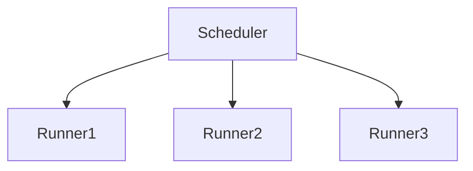
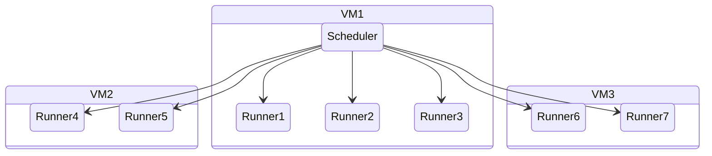
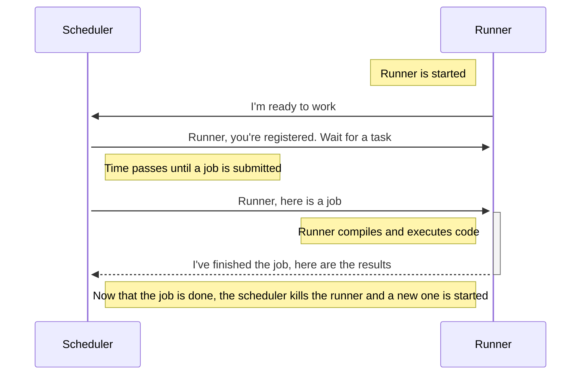

# Architecture

This document gives an overvie 

# Purpose

Within Computer Science at Carleton, several courses will grade students by
running tests on their code, and verifying that tests complete properly. Some of
these courses, like 2402, will even allow students to run their code before they
submit their assignments. This allows students to get a good idea of whether or
not their code might be handling all test cases properly.

This project is an attempt to try and modernize this process, and find a way
that other courses might be able to also make use of a platform like this. A
primary goal of this project is to build a solution that can be distributed
across several VMs as to not be limited by the resources of a single machine.

This document breaks down this application by "crate"; Rust's equivalent of
libraries.

# Crates

## grading-scheduler

A single scheduler will manage all runners for any assignment at Carleton. It's
single purpose is to receive a task to execute, and figure out how to execute
it. It will also support different "flavours" of runner, for if certain courses
require reduced resouces that are greater or less than the standard. For
example, 2402 might want students to have access to 100cpu/256mb ram, while 2404
could want 1000/1024.

This entire system runs on several VMs in the School of Computer Science
OpenStack. Nomad is used to orchestrate the scheduler, and more importantly, the
runners.

The reason for this more intricate setup is that running the grading system on a
single node leads to congested processing closer to when an assignment is due,
as more students are simultaneously submitting jobs. This process can scale
nicely across several different machines to mitigate this issue. Further, Nomad
allows you to set a max amount of compute/ram for specific jobs, which can be
helpful to make sure that students get the same speed of execution regardless of
how many other students are also trying to submit their code at that time.

Both the scheduler and the runners are written in Rust. The reason for this is
the ease of writing code that works in the async/threaded context of this
project. Further, it's easy to make sure that types are safe across the network.
Most importantly, Rust (🚀) is fun!

## grading-runner

Each runner is made up of a binary running in a Docker container that has
language toolchains installed for Java, Python, and C/C++. This binary will, in
order:

- Start a backend server
- Register, then eventually receive a job
- Execute this job
- Return the results

At this point, the runner will be killed by the scheduler. See the diagram below
for a full

### Lifetime of a runner

Runners are valid from the point they register with the scheduler until the
point that they finish execution on a single job. At that point, they need to be
killed to keep the initial environments clean. When a runner is killed, Nomad
will automatically provision another as it attempts to keep the cluster's state
at a constant number of living containers. The diagram below describes the full
lifetime of a runner:

## grading-schema

This crate stores all of the types that are relevant to both the scheduler and
the runner. Since both use this crate, synchronicity of data is guaranteed when
both are deployed.

## Web frontend (TODO)

The web frontend will have two sides; the student submission side, and the
instructor/TA management side.

### Instructor view

- Add a new assignment
- Make changes to an assignment spec
- Regrade all most-recent submissions
- Add tests for an assignment

### Student view

- Sign in, see courses that are on platform
- See previous assignment submission's results
- Submit a new iteration of an assignment

### Nice-to-haves

- Telemetry of the platform
- Progress bars

## Web backend (TODO)

- Handle accounts
- Handle state of assignments