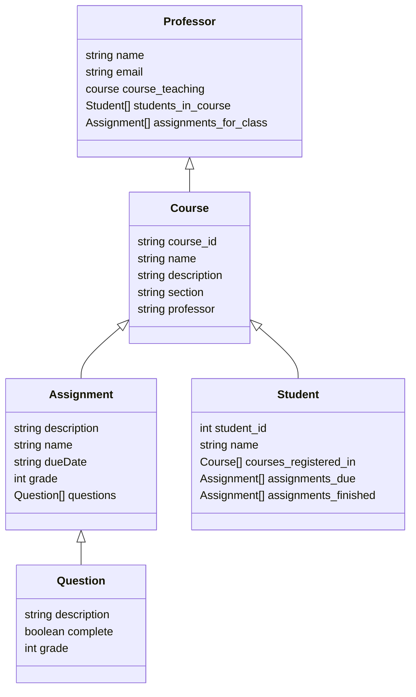

```mermaid
 classDiagram
      Course <|-- Assignment
      Assignment <|-- Question
      Professor <|-- Course
      Course <|-- Student
      
      class Assignment{
          string description
          string name 
          string dueDate
          int grade
          Question[] questions
      }
      
      class Course {
          string course_id
          string name
          string description
          string section
          string professor
      }
      
      class Student {
         int student_id
         string name
         Course[] courses_registered_in
         Assignment[] assignments_due
         Assignment[] assignments_finished
      }
      
      class Professor {
          string name
          string email
          course course_teaching
          Student[] students_in_course
          Assignment[] assignments_for_class
      }
      
      class Question {
          string description
          boolean complete
          int grade
      }
      
      
```
